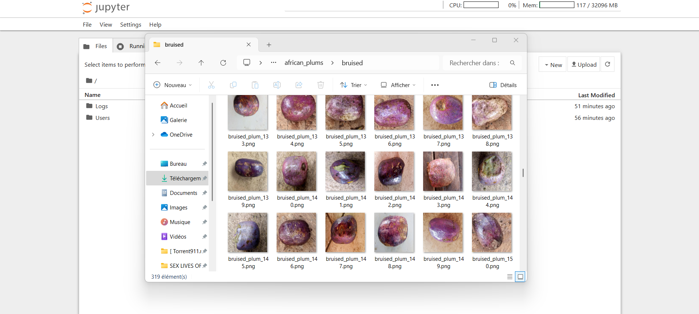
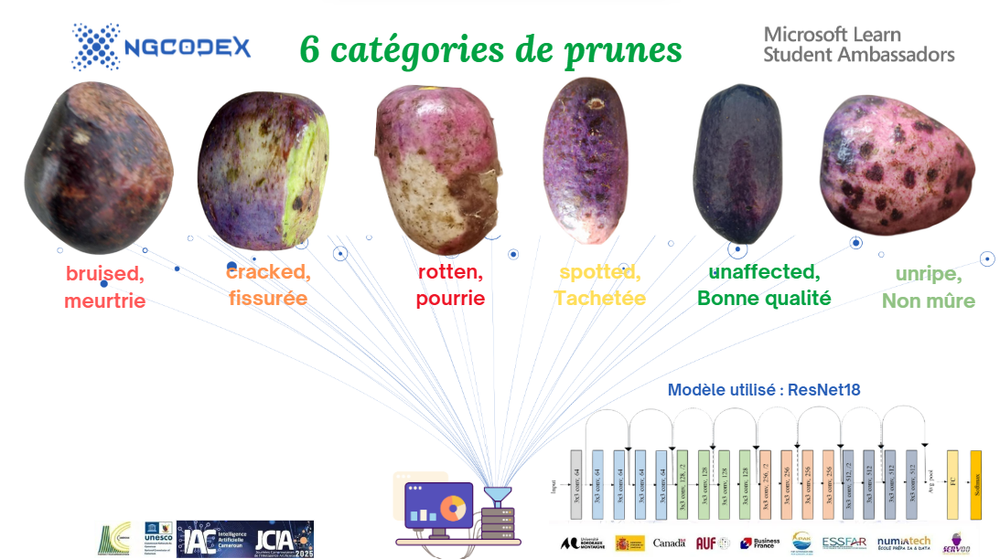

# 🟣 JCIA Hackathon 2025 – Tri Automatique des Prunes 🍑

Developpé par: NGcodeX
Membre: ZEBS HAUPUR ET TIOJIO ROMAIN



Bienvenue dans notre projet NGcodeX de classification automatique des prunes, réalisé dans le cadre du **JCIA Hackathon 2025** organisé au Cameroun. Ce projet a été développé dans le cadre du JCIA Hackathon 2025. Il a pour objectif de proposer une solution basée sur l’intelligence artificielle pour automatiser le tri des prunes africaines selon leur qualité visuelle. En utilisant un modèle ResNet18 entraîné avec PyTorch, notre système est capable de reconnaître 6 classes de prunes : meurtrie (bruised), fissurée (cracked), pourrie (rotten), tachetée (spotted), bonne (unaffected) et non mûre (unripe). Le modèle a été entraîné sur Azure Machine Learning Studio, évalué, puis intégré dans une application web développée avec Streamlit. L’utilisateur peut simplement téléverser une image de prune et recevoir instantanément la prédiction du modèle. Ce projet met en valeur l'utilisation concrète de l’IA pour répondre à un besoin du secteur agricole africain, tout en restant accessible, reproductible et open source.


Ce projet utilise des techniques avancées de **vision par ordinateur** et **d'apprentissage profond** pour trier des prunes africaines en six catégories de qualité :

- ✅ Bonne qualité  
- 🍏 Non mûre  
- 🟡 Tachetée  
- ⚡ Fissurée  
- 💔 Meurtrie  
- ❌ Pourrie

  

---

## 📌 Objectif

Développer un modèle d'intelligence artificielle performant capable de **classifier des images de prunes** avec un haut niveau de précision, à partir du dataset [African Plums - Kaggle](https://www.kaggle.com/datasets/arnaudfadja/african-plums-quality-and-defect-assessment-data).

---

## ⚙️ Technologies utilisées

- **Langage** : Python 3.10  
- **Frameworks** : PyTorch / TensorFlow  
- **Outils Cloud** : Microsoft Azure (Azure Machine Learning, Azure Storage, Custom Vision)  
- **Librairies** : OpenCV, scikit-learn, matplotlib, pandas, numpy  

---

## 🧱 Architecture

Notre solution suit cette architecture :

1. **Chargement et Prétraitement** des images
2. **Construction du modèle CNN**
3. **Entraînement et validation**
4. **Évaluation des performances** (Accuracy, Confusion Matrix)
5. **Déploiement** (optionnel) sur Azure ou via API REST

---

## 📁 Arborescence du projet


---

## 🚀 Lancer le projet

```bash
# Cloner le dépôt
git clone https://github.com/<ton-nom-utilisateur>/jcai-hackathon-prunes.git

# Installer les dépendances
pip install -r requirements.txt

# Lancer l'entraînement
python src/train.py

# Tester une image
python src/predict.py --image chemin/vers/image.jpg

